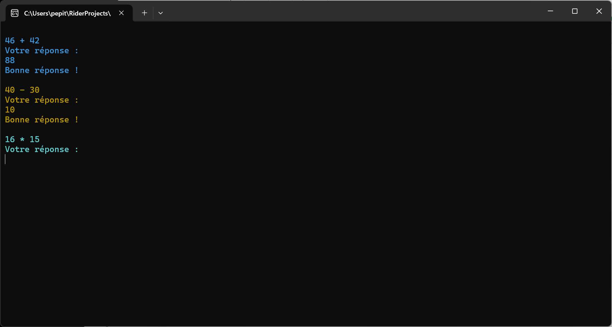
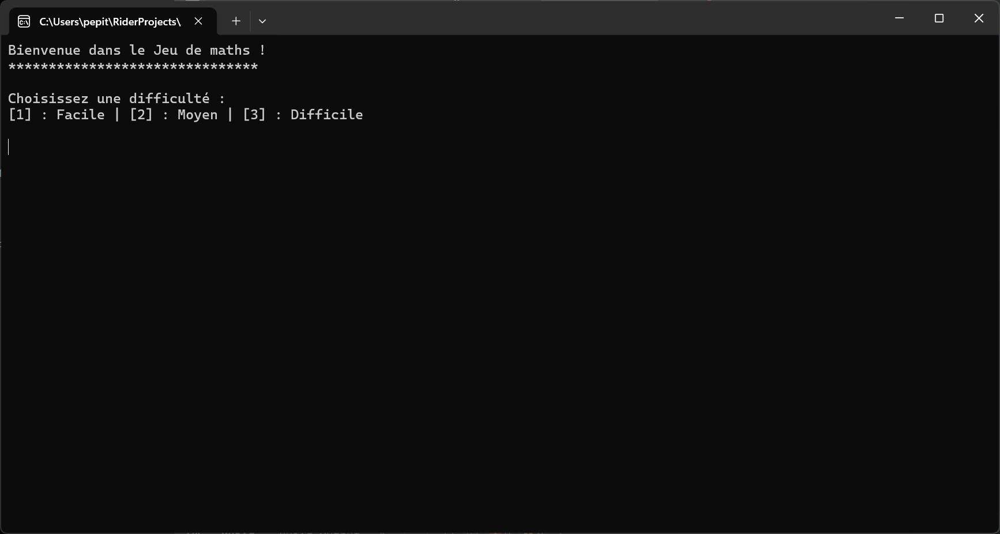
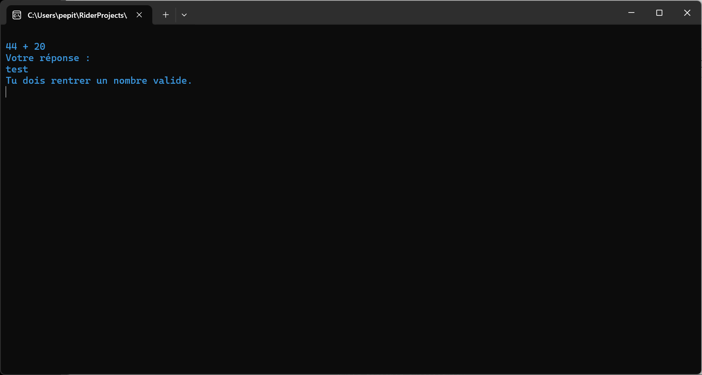
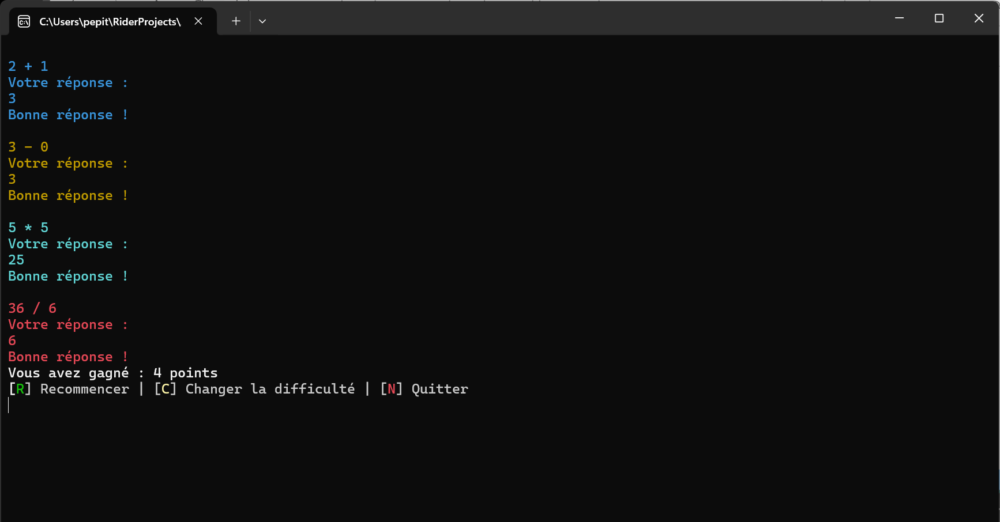

# 🎮 Jeu de Maths ➗➕✖️➖

---

## 📝 **Description**
Le **Jeu de Maths** est un jeu console développé en **C#**. L'utilisateur doit résoudre des opérations mathématiques aléatoires :  
**➕ Addition**, **➖ Soustraction**, **✖️ Multiplication**, et **➗ Division** (*résultats entiers uniquement*).  
Le programme valide les entrées utilisateur, suit les réponses correctes et attribue un score. À la fin, le joueur peut choisir de **recommencer**, **changer de difficulté**, ou **quitter**.

---

## ✨ **Fonctionnalités**

- **🔢 Génération d'opérations mathématiques aléatoires :**
   - ➕ Addition
   - ➖ Soustraction
   - ✖️ Multiplication
   - ➗ Division (*résultats entiers uniquement*)

- **✅ Validation des entrées utilisateur :**
   - Messages clairs en cas d’erreur ou d’entrée non valide.

- **🏆 Calcul du score :**
   - Un point est attribué pour chaque réponse correcte.

- **🔄 Redémarrage du jeu :**
   - L'utilisateur peut recommencer une nouvelle partie à la fin.

---

## 👀 **Aperçu**

Voici un aperçu du jeu **Jeu de Maths** en action :

---

1. **📖 Début du jeu**

   Le jeu affiche une opération mathématique aléatoire et attend une réponse du joueur :  
   

---

2. **⚙️ Modification de la difficulté**

   L'utilisateur peut changer la difficulté en début ou fin de partie :  
   

---

3. **❌ Gestion des erreurs**

   Si l'utilisateur entre une valeur invalide, un message d'erreur s'affiche :  
   

---

4. **🏁 Résultat final**

   À la fin du jeu, le score total est affiché, et le joueur peut choisir de recommencer, de changer de difficulté, ou de quitter :  
   

---

## 🛠️ **Technologies utilisées**

- **Langage :** C#
- **Environnement :** Application console
- **IDE :** JetBrains Rider (compatible avec Visual Studio)

---

## 🚀 **Instructions pour exécuter le projet**

1. **Clonez ce dépôt sur votre machine :**
   ```bash
   git clone https://github.com/YouShallNotBug/jeu-de-maths.git

2. **Lancez l'executable présent dans :**
   ```bash
   Jeu-de-maths\bin\Release\net9.0\Jeu-de-maths.exe

## **🤝 Contributions**
Les contributions sont les bienvenues ! Si vous avez des idées pour améliorer le jeu, n’hésitez pas à :
+ Ouvrir une issue 📄
+ Soumettre une pull request 🚀

## **📜 License**
Ce projet est sous la MIT License. Consultez le fichier LICENSE pour plus de détails.

## **🎉 Merci d'avoir testé le Jeu de Maths !**
